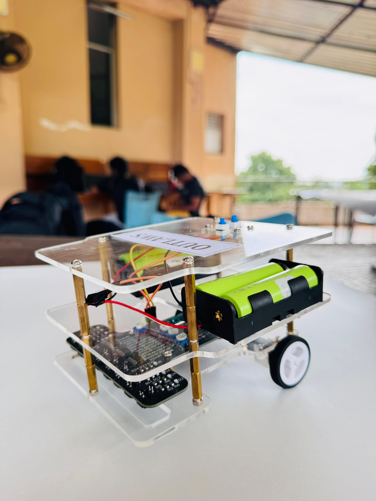
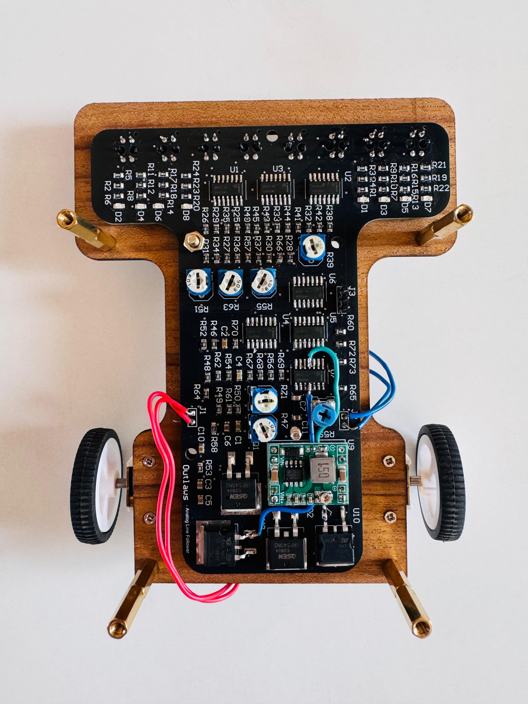

# 🛣️ Analog Line Following Robot (Fully Analog PID)

  <b>A microcontroller-free line following robot using pure analog signal processing</b>

  Designed & built by <b>Team Outlaws</b>  
  Department of Electronic & Telecommunication Engineering  
  University of Moratuwa, Sri Lanka

---

## 🎥 Full Demo Video

  
  

---

## 📸 Robot Overview

### Front View & PCB

  

  

---

## 🧠 System Architecture (Purely Analog)

This project presents a **fully analog line-following robot**, where **all sensing, control,
and actuation are implemented using analog circuits only** — no microcontroller, no
firmware, and no digital computation.

The system operates as follows:

- **8-channel IR sensor array (TCRT5000)** generates continuous analog voltages
- **Buffer circuits** isolate sensor outputs
- **Weighted scaling adders** compute left and right positional values
- **Differential amplifier** produces the line error signal
- **Fully analog PID controller (LM324)** computes corrective action
- **Analog PWM generator** (triangle wave + comparator) converts control signal to PWM
- **Transistor-based motor drivers** actuate DC motors

This architecture enables **real-time, low-latency, deterministic control**.

---

## ⚙️ Key Features

- 🔌 **100% Analog Control System**
- 📡 **Continuous sensor feedback**
- 🎚️ **Adjustable P, I, D gains**
- ⚡ **Low-latency real-time response**
- 🧩 **Custom 2-layer SMD PCB**
- 🖨️ **3D-printed enclosure**
- 🧪 **Simulation-verified & hardware-tested**

---

## 🖥️ Simulation & Hardware Testing

- PID stability verified through circuit simulation
- PWM waveform validated using oscilloscope measurements
- Smooth line tracking with minimal overshoot

---

## 🧑‍🤝‍🧑 Team Outlaws

  

| Name | Index No | Contribution |
|------|---------|--------------|
| A.N. Wedamestrige | 230687P | Circuit design, simulation & debugging |
| R.J.K.O.H. Ranathunga | 230525U | Circuit analysis & enclosure design |
| M.N. Kumarasinghe | 230355X | PCB design |
| W.V.M.J. Himasara | 230248X | Soldering & hardware testing |

---

## 📄 Documentation

📘 Full technical report available in this repository:  
`17_Outlaws_EN2091_Analog_Project.pdf`
